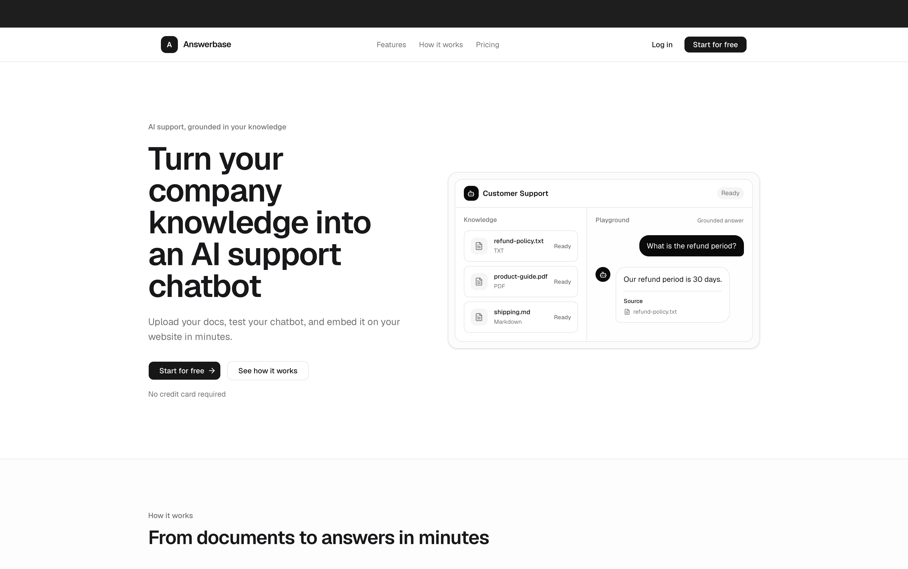
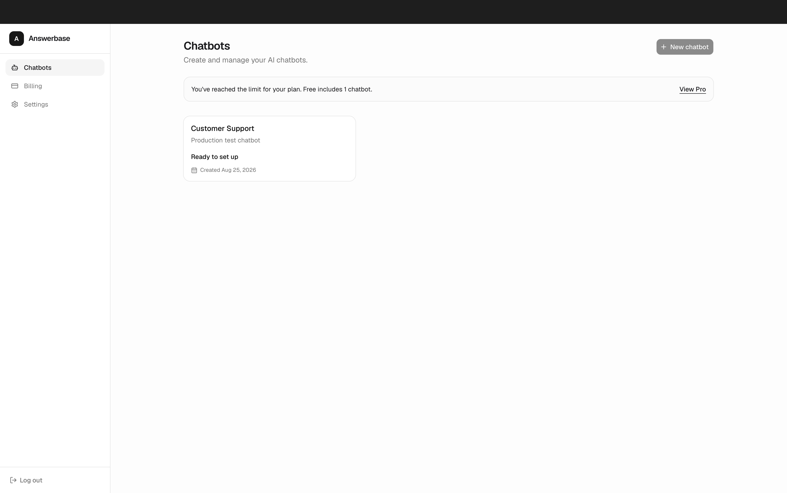
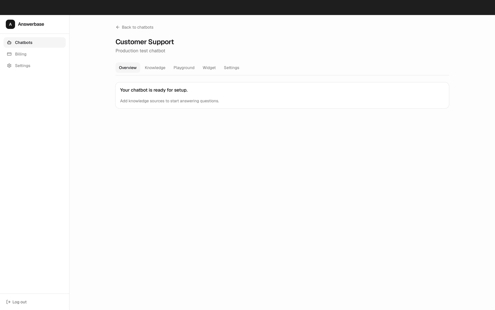
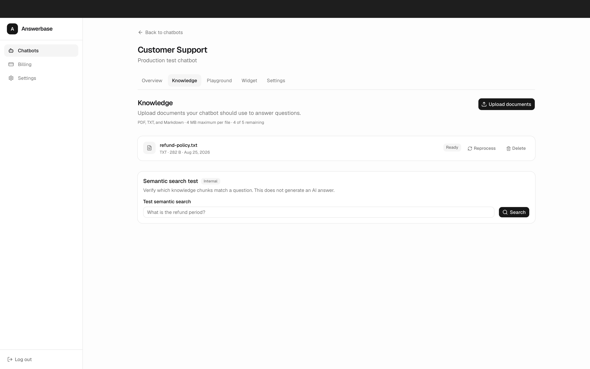
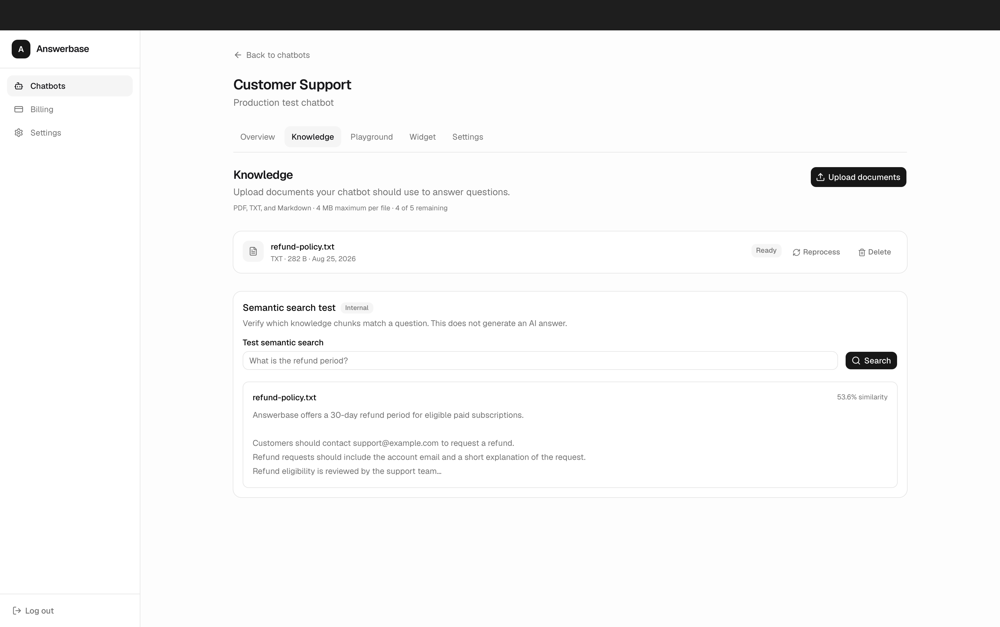
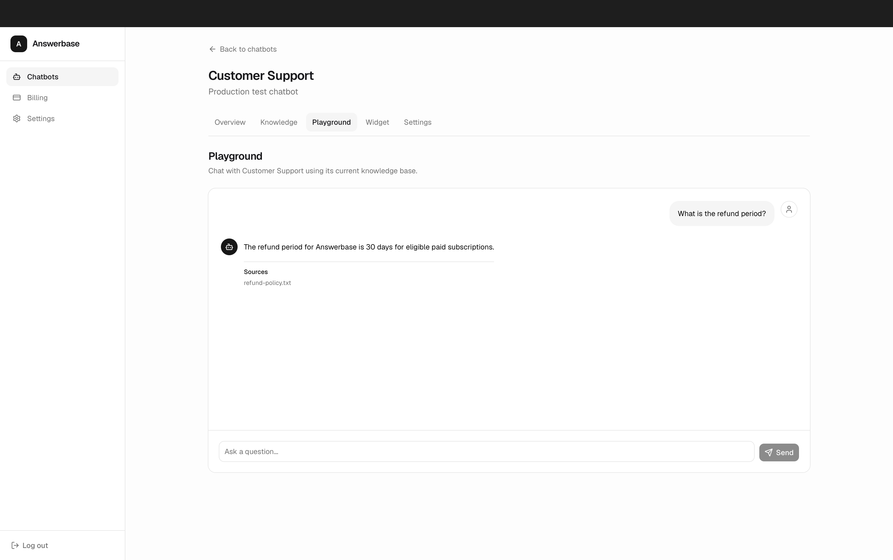
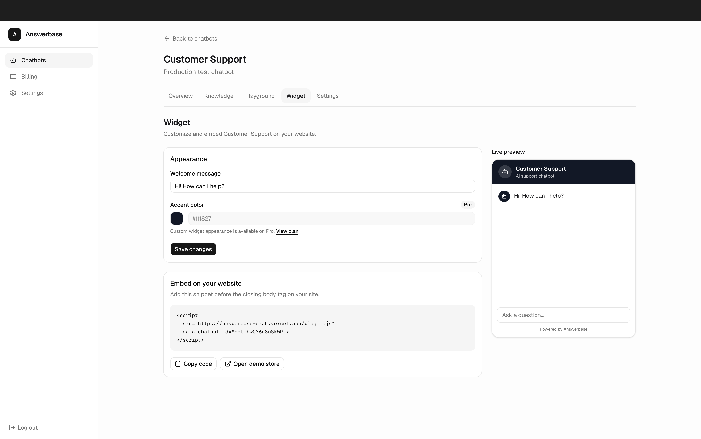
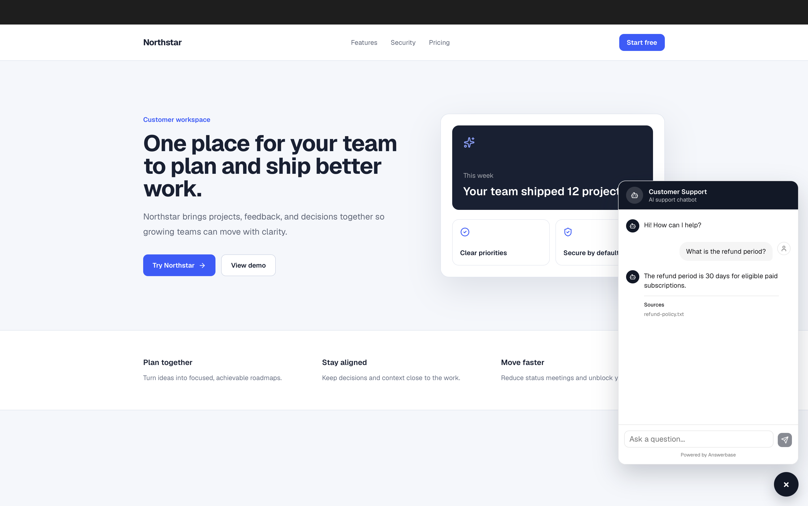
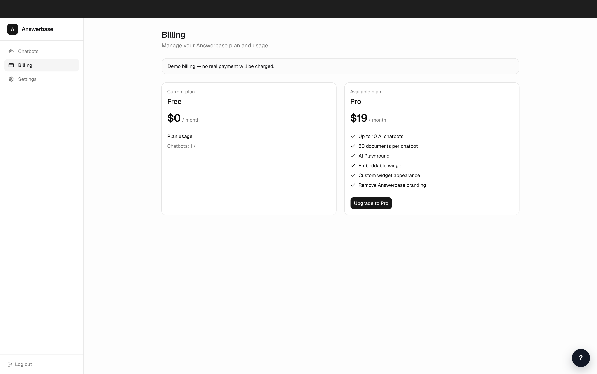

# Answerbase — Product Walkthrough

Answerbase turns company documents into a grounded AI support chatbot that can be tested inside the application and embedded on a customer-facing website.

**Live demo:** [answerbase-drab.vercel.app](https://answerbase-drab.vercel.app)

**GitHub:** [KlinovK/answerbase](https://github.com/KlinovK/answerbase)

> [!NOTE]
> Custom SMTP is not configured. Supabase's built-in email delivery is limited to approximately two confirmation emails per hour. If you see “Too many confirmation emails were requested. Try again later.”, retry later.
>
> Billing is mocked for this MVP. No real payment is collected.

## 1. Start from the landing page



The landing page introduces the core value: turning existing company knowledge into an AI support chatbot. It summarizes the Free and Pro plans and provides a direct path to create an account and get started.

## 2. Manage chatbots from the dashboard



The dashboard is the central place for creating and managing chatbots. The Free plan supports one chatbot; when that limit is reached, the interface explains the restriction and points toward the Pro plan.

## 3. Configure an individual chatbot



Each chatbot has focused sections for **Overview**, **Knowledge**, **Playground**, **Widget**, and **Settings**. A chatbot owns an isolated knowledge base and its own public widget configuration, keeping its content and customer-facing experience separate from other chatbots.

## 4. Add company knowledge



The Knowledge section accepts PDF, TXT, and Markdown documents. The application currently accepts files up to 4 MB, while the private Supabase Storage bucket has a 10 MB safety ceiling.

Uploaded files remain private. Answerbase extracts and normalizes their text, divides it into useful chunks, creates embeddings, and marks the document **Ready** when processing completes.

## 5. Verify retrieval with semantic search



Semantic Search provides a transparent way to inspect retrieval before generating an answer. For the question “What is the refund period?”, Answerbase embeds the query, searches the chatbot's pgvector-backed knowledge, and returns the relevant chunk from `refund-policy.txt`. This is the retrieval stage of the RAG pipeline.

## 6. Test grounded answers in the Playground



The Playground retrieves relevant knowledge, sends that grounded context to the model, and returns a concise answer with its source document. When the uploaded knowledge does not support an answer, the chatbot uses a safe fallback instead of inventing information.

## 7. Configure the embeddable widget



The Widget section provides the embed snippet and controls the welcome message shown to visitors. Each widget is addressed by the chatbot's non-sequential public ID. Pro adds custom appearance options and allows Answerbase branding to be removed; Free widgets retain the branding.

## 8. Preview the customer experience



The Demo Store simulates a customer website. The host page loads `widget.js`, which opens the chatbot in an isolated iframe so page styles do not interfere with it. Visitors can ask questions without an Answerbase account, and answers remain grounded in that chatbot's own knowledge base.

## 9. Review plan limits



The Free plan is $0 and includes one chatbot, five documents per chatbot, the Playground, and an embeddable widget with Answerbase branding. The $19/month Pro demo plan supports up to ten chatbots, fifty documents per chatbot, widget customization, and branding removal.

Billing is mocked, but upgrade and downgrade behavior is functional. Limits are enforced on the server, and a downgrade is blocked until usage fits within the Free plan.

## How it works

```text
Documents
  → text extraction and normalization
  → chunking
  → OpenAI embeddings
  → Supabase pgvector storage
  → semantic retrieval
  → grounded answer
  → source citations
```

Answerbase is built with Next.js, React, TypeScript, Supabase Auth, Postgres with pgvector, private Supabase Storage, OpenAI `text-embedding-3-small` embeddings, `gpt-4.1-mini` answer generation, and Vercel deployment.

## Implementation notes

- Row Level Security protects user-owned database records.
- Chatbot ownership is verified on the server for private application routes and actions.
- Knowledge files are stored in a private bucket rather than exposed through public URLs.
- Supabase secret credentials and the OpenAI key remain server-only.
- Non-sequential `public_id` values identify public widgets without exposing internal IDs.
- Retrieval is scoped to the selected chatbot so knowledge cannot cross between chatbots.
- Free and Pro usage limits are enforced server-side, not only in the interface.

## MVP scope

- Billing is mocked and does not use Stripe or collect real payments.
- Authentication uses Supabase's default email delivery rather than custom SMTP.
- Conversations are not persisted.
- Teams and organizations are not implemented.
- Document processing runs without background job infrastructure.
- Product analytics are not included.
